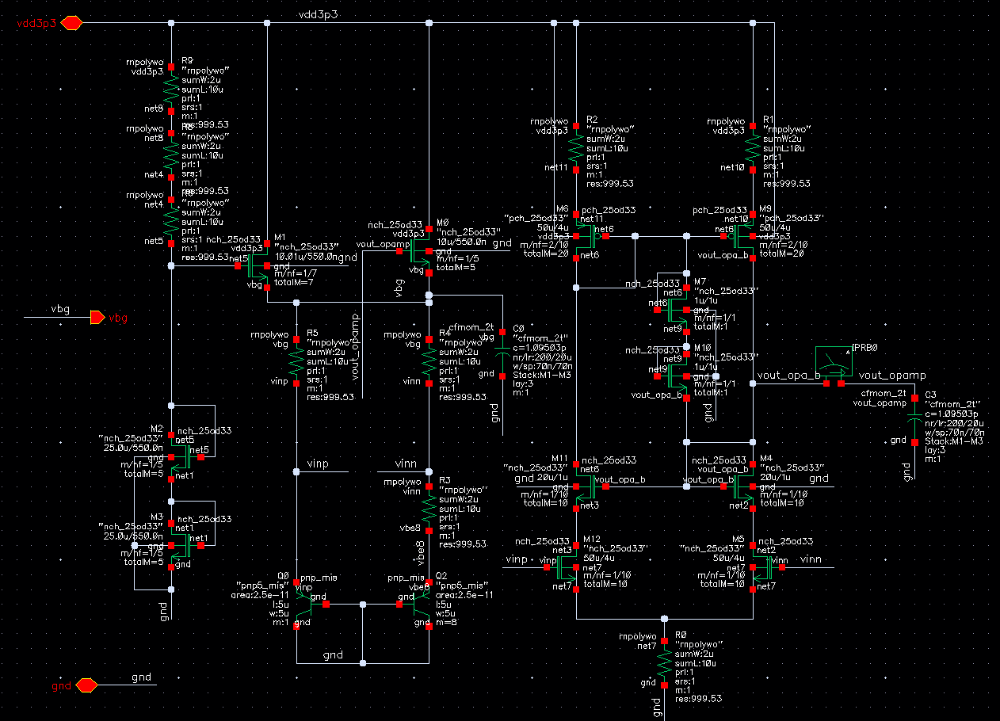
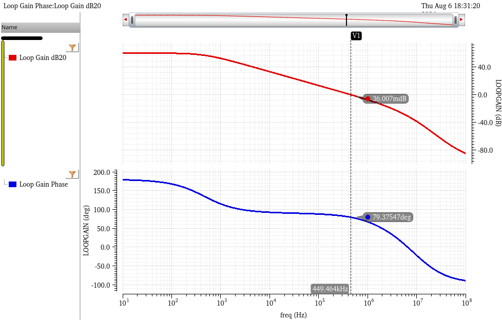
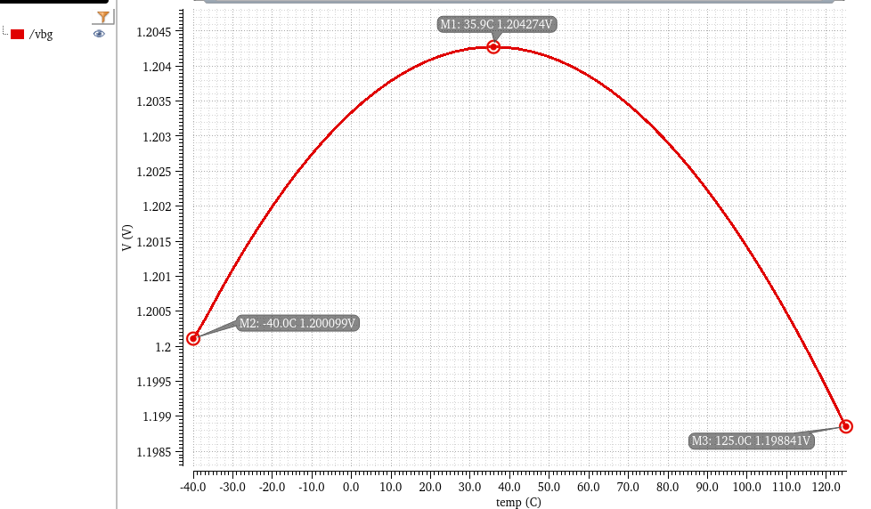
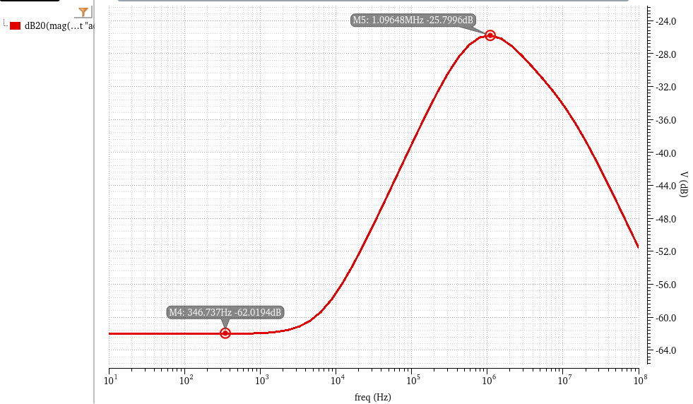
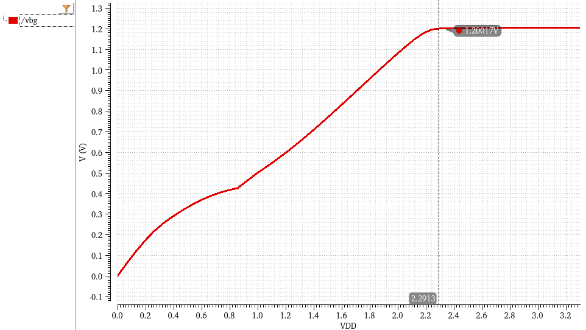
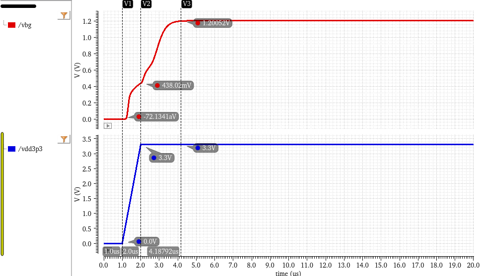

# Bandgap Voltage Reference (BGR)

This directory contains the schematic and simulation results for the Bandgap Voltage Reference module. Acting as the precision "heart" of the PMIC, this sub-circuit provides a highly stable, temperature-compensated 1.2V reference voltage ($V_{ref}$) to the LDO Error Amplifier, ensuring accurate regulation across extreme environments.

## 1. Circuit Architecture & Design Rationale

The design utilizes a classic **Operational Amplifier-Based (Op-Amp Clamped) Bandgap Architecture**, optimized for ultra-low quiescent current. 

### Core Operating Principles:
* **PTAT and CTAT Summation:** To achieve a zero-temperature-coefficient (ZTC) reference, the circuit sums a Proportional-to-Absolute-Temperature (PTAT) voltage and a Complementary-to-Absolute-Temperature (CTAT) voltage. 
* **Op-Amp Clamping:** The core utilizes two PNP bipolar junction transistors (BJTs) operating at different current densities (area ratio $m=1$ vs. $m=8$). The internal high-gain error amplifier senses the voltages at nodes `vinp` and `vinn`. It continuously drives the top PMOS current mirrors to force these two nodes to be exactly equal. This closed-loop feedback generates a precise PTAT current across the resistor ($R_3$), which is then mirrored and pushed through a series resistor network and a diode-connected BJT to generate the final 1.2V output.
* **Startup Circuit:** Bandgap circuits inherently have a "zero-current degenerate state" where all transistors remain off indefinitely. The left-side auxiliary network acts as a startup circuit. During power-on, it injects a small initial current to kick-start the op-amp and BJT branches. Once the normal operating point is established, the startup circuit automatically shuts off to eliminate leakage and save power.

**Key Specifications:**
* **Quiescent Current (Iq):** 9.835 µA 
* **Nominal Output Voltage (Vbg):** 1.20 V

*(Fig 1. Bandgap Reference Schematic with Op-Amp Clamping and Startup Circuit)*

---

## 2. Performance Metrics

### 2.1 Loop Stability (STB)
To ensure the internal op-amp does not oscillate under closed-loop conditions, a stability (STB) analysis was executed. Breaking the loop at the op-amp output confirms a highly stable system, guaranteeing no ringing or parasitic oscillations.
* **Phase Margin (PM):** 79.37° (Extremely stable, well above the standard 60° target)
* **Unit Gain Bandwidth (UGBW):** 449.5 kHz

*(Fig 2. Bode plot showing Loop Gain and Phase Margin)*

### 2.2 Temperature Coefficient (TC)
A DC temperature sweep was performed from -40°C to 125°C to verify the effectiveness of the PTAT/CTAT compensation. The resulting curve exhibits the classic BGR "parabolic" shape.
* **Maximum Voltage:** 1.20427 V (at 35.9°C)
* **Minimum Voltage:** 1.19884 V (at 125°C)
* **Voltage Variation (ΔV):** ~5.43 mV over a 165°C span.
* **Effective TC:** Approximately 27.4 ppm/°C (Untrimmed), demonstrating excellent thermal stability for wearable applications.

*(Fig 3. Vbg Output vs. Temperature)*

### 2.3 Power Supply Rejection Ratio (PSRR)
AC analysis highlights the BGR's ability to reject noise and ripples from the input power supply (VDD). The op-amp's high DC gain contributes to excellent low-frequency rejection.
* **Low-Frequency PSRR:** -62.02 dB (measured at 346 Hz)
* **High-Frequency Peak:** -25.8 dB (around 1.1 MHz)

*(Fig 4. PSRR across frequency spectrum)*

### 2.4 DC Line Regulation
The DC VDD sweep demonstrates the minimum operating voltage (dropout) and line regulation capability. The output voltage successfully stabilizes to the 1.2V target once VDD surpasses 1.6V, and remains exceptionally flat up to 3.3V (measured at 1.20017 V at VDD = 2.29 V).

*(Fig 5. Output Voltage vs. VDD Sweep)*

### 2.5 Startup Transient
The transient simulation verifies the robust functionality of the startup circuit. When VDD ramps up rapidly (within 1 µs), the startup network immediately pulls the BGR out of the zero-current state.
* **Settling Time:** The output smoothly reaches the 1.2V target at ~4.2 µs (settling in approx. 2.2 µs after the VDD ramp completes) without any dangerous voltage overshoot.

*(Fig 6. Startup transient response during VDD power-on)*
