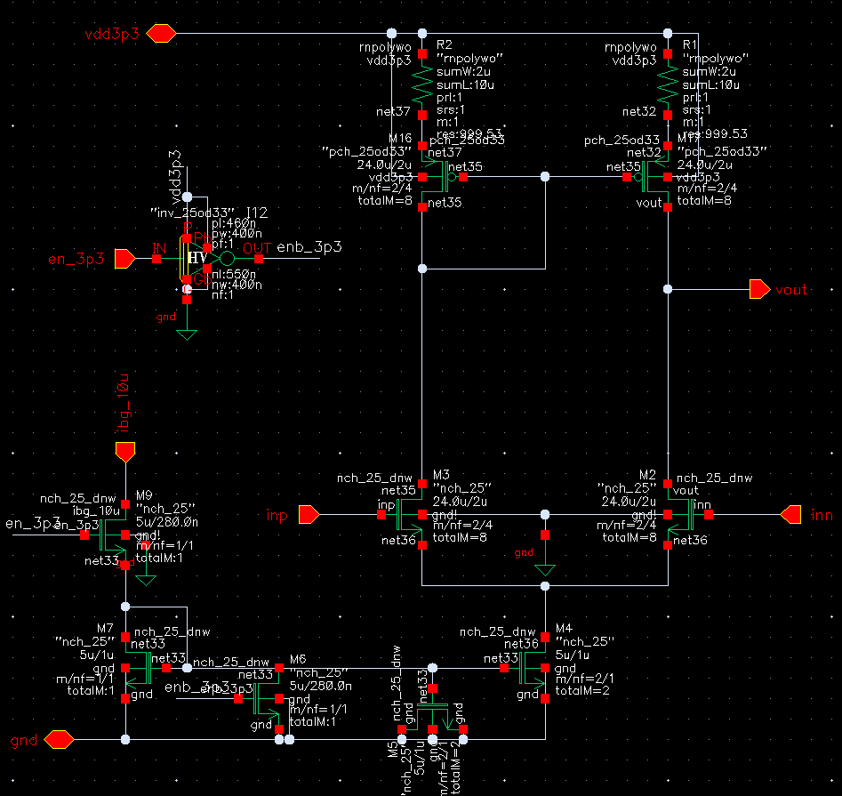
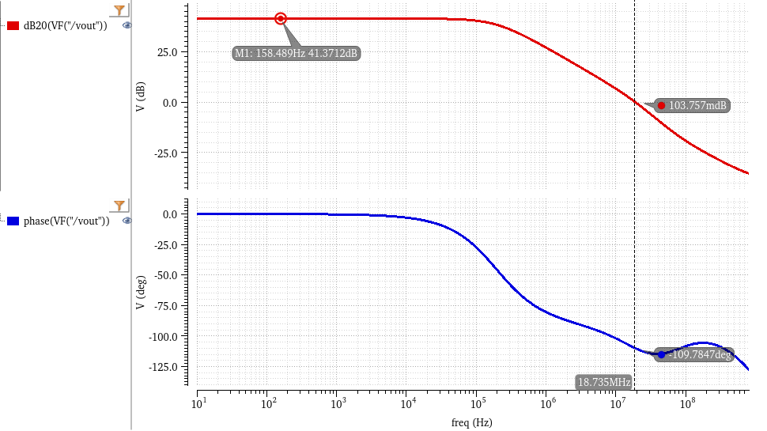
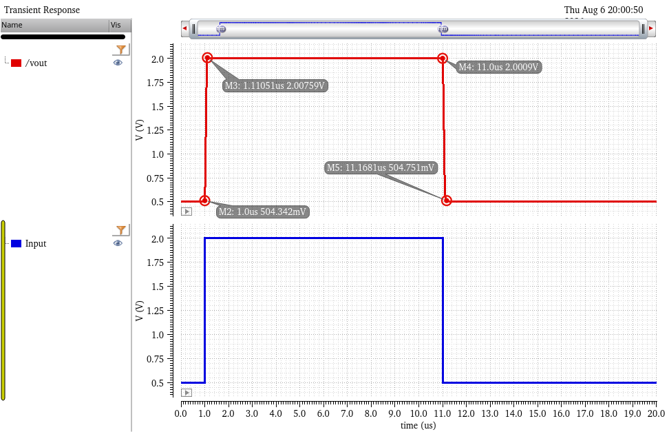
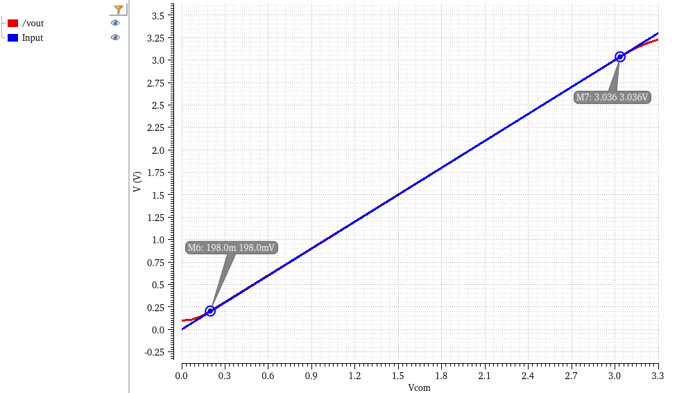

# Error Amplifier (EA) for LDO

This directory contains the schematic and sub-block simulation results for the Error Amplifier. As the primary control engine of the LDO in active mode, this amplifier continuously monitors the feedback voltage and drives the power PMOS gate to maintain a regulated output.

## 1. Circuit Architecture & Design Rationale

The module employs a **Source-Degenerated Differential Amplifier** with an active load, strictly optimized for ultra-low power consumption and zero sleep-mode leakage.

### Core Operating Principles:
* **Source Degeneration:** Resistors (R1, R2) are introduced at the sources of the active load PMOS pair. This technique intentionally degrades the transconductance slightly to improve the amplifier's linearity, lower the noise floor, and provide better matching characteristics without burning extra current.
* **Deep-Sleep Cut-off Logic:** To achieve true nano-ampere level standby power for the overall PMIC, the EA includes dedicated enable logic (`en_3p3`). When pulled low (0V), the tail current source (M4/M5) and bias branches are physically disconnected from the ground, eliminating quiescent current paths.
* **Current Budget:** The total active-mode static current (Iq) is strictly limited to **20 µA** (including biasing). In sleep mode, the leakage current drops to effectively **0 A**.

*(Fig 1. Error Amplifier schematic featuring source degeneration and sleep cut-off logic)*

---

## 2. Performance Metrics

### 2.1 AC Open-Loop Response
An open-loop AC analysis was performed with a 1 pF load (simulating the parasitic gate capacitance of the subsequent power stage) to evaluate the core loop characteristics.
* **DC Gain:** 41.37 dB (Sufficient for accurate regulation while maintaining stability)
* **Unit Gain Bandwidth (UGBW):** 18.74 MHz
* **Phase Margin (PM):** 70.22° (Providing excellent closed-loop stability)

*(Fig 2. Bode plot illustrating open-loop gain and phase)*

### 2.2 Slew Rate & Large Signal Response
Configured as a unity-gain buffer, a large-signal pulse (0.5V to 2.0V) was applied to measure the slewing capabilities. 
* **Rising Slew Rate (SR+):** ~13.6 V/µs
* **Falling Slew Rate (SR-):** ~8.9 V/µs
* **Design Trade-off Verification:** The asymmetrical and restricted slew rate is a direct consequence of limiting the tail current to 20 µA. This definitively explains the known "Cold-Start Overshoot" observed in the top-level transient simulations. It is a calculated compromise to prioritize battery life over sub-microsecond wake-up speeds.

*(Fig 3. Large-signal transient response demonstrating slew-rate limitations)*

### 2.3 Input Common-Mode Range (ICMR)
A DC sweep was conducted in a unity-gain buffer configuration to define the linear tracking region of the amplifier.
* **Lower Bound:** ~0.20 V
* **Upper Bound:** ~3.04 V
* **Result:** The required reference voltage ($V_{ref}$ = 1.2V) is perfectly centered within this robust common-mode range, ensuring linear operation free from distortion.

*(Fig 4. Unity-gain DC sweep highlighting the linear ICMR)*
