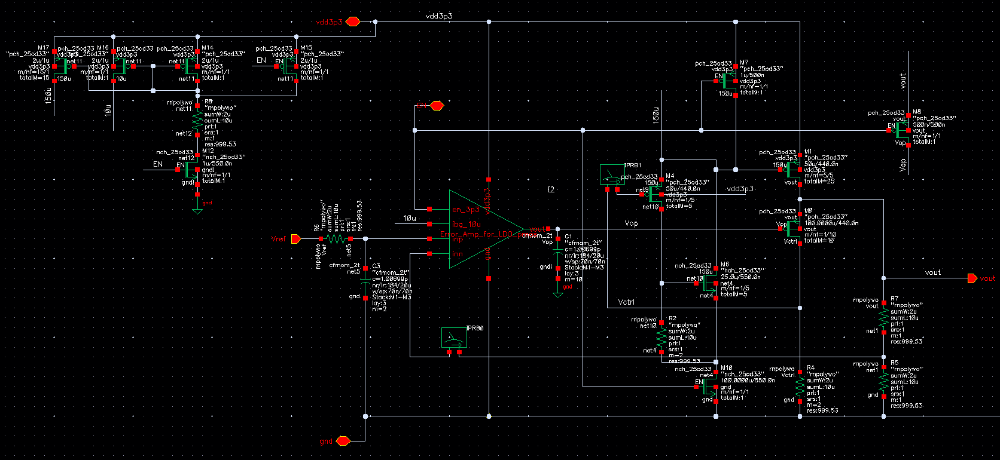
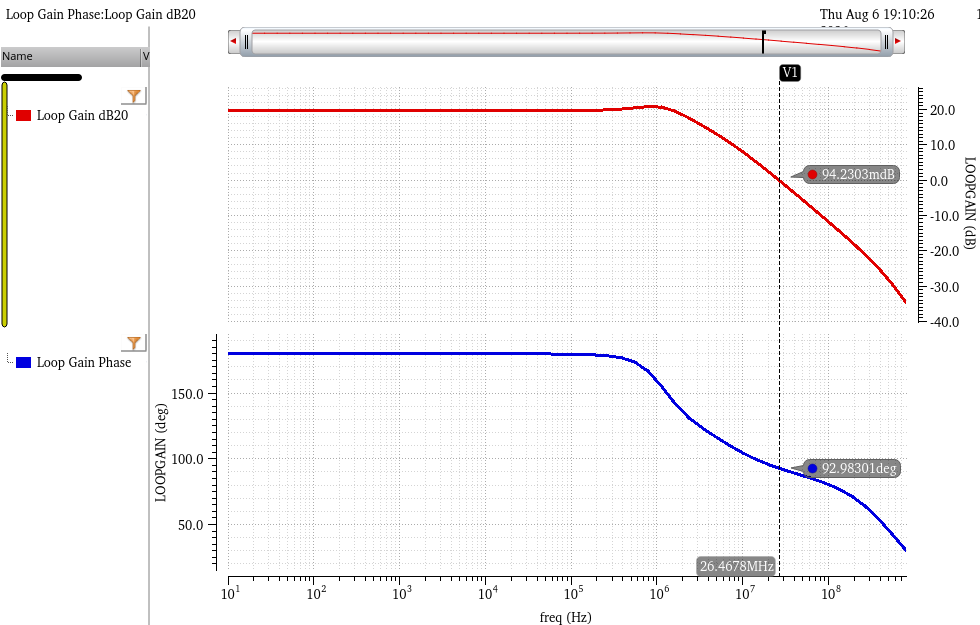
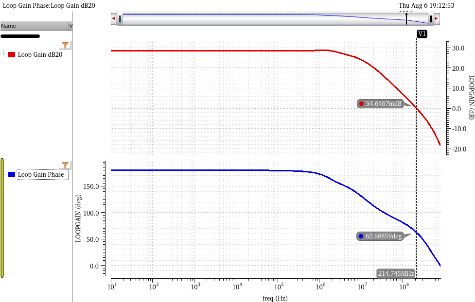
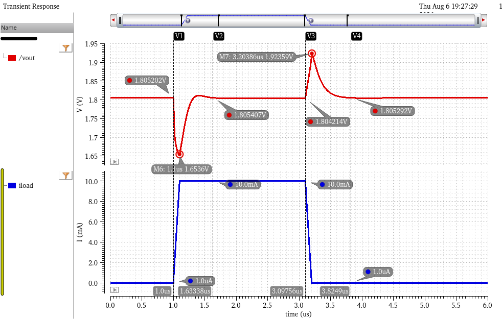
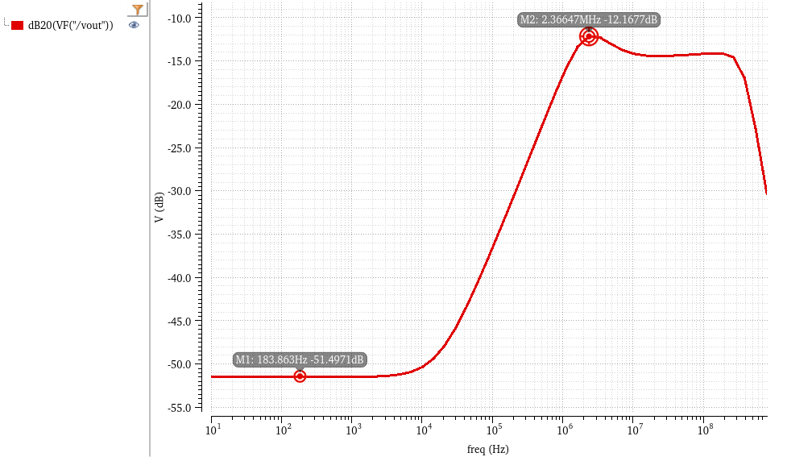
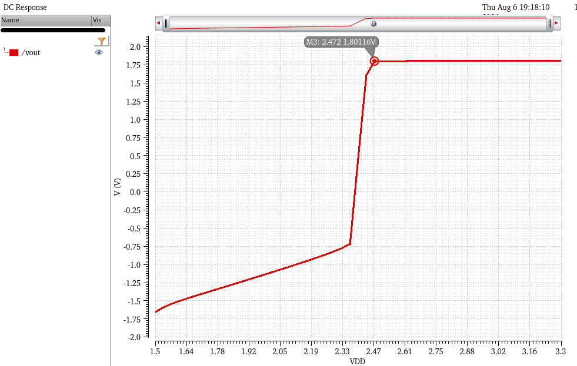

# FVF & SSF LDO Core (Active Power Stage)

This directory contains the schematic and simulation results for the primary active low-dropout (LDO) regulator core. It integrates a **Flipped Voltage Follower (FVF)** and a **Super Source Follower (SSF)** to achieve ultra-fast transient responses without the need for large, area-consuming off-chip decoupling capacitors.

## 1. Circuit Architecture & Design Rationale

This module is exclusively active during the system's "wake-up" state (`EN = 3.3V`) to handle high-current logic workloads. 

### Core Operating Principles:
* **Flipped Voltage Follower (FVF):** Traditional LDOs suffer from poor transient response because the dominant pole is tied to the high-impedance output node. The FVF architecture solves this by introducing a local shunt-feedback loop. This drastically lowers the output impedance, pushing the dominant pole to a higher frequency and enabling the LDO to respond to microsecond-level load steps almost instantaneously.
* **Super Source Follower (SSF):** To further enhance the driving capability of the main power PMOS, an SSF buffer is inserted between the Error Amplifier and the power transistor gate. It provides dynamic current boosting during rapid load transitions.
* **Power Breakdown:** At a full 10mA load, the total measured current is 10.74mA. Subtracting the load, the active internal quiescent current ($I_{q\_active}$) is approximately **740µA**. This is a deliberate design trade-off: trading active-mode power for gigahertz-level internal bandwidth.

*(Fig 1. LDO Core Schematic featuring FVF and SSF structures)*

---

## 2. Performance Metrics

### 2.1 Loop Stability (STB Analysis)
LDO stability typically degrades at extreme load boundaries. STB analysis was performed across the entire load spectrum to ensure absolute stability.
* **Light Load (1µA):** Phase Margin = 92.98°, UGBW = 26.46 MHz.
* **Heavy Load (10mA):** Phase Margin = 62.68°, UGBW = 214.74 MHz.
* **Conclusion:** The system remains completely stable (PM > 60°) across all operating conditions, with a massive bandwidth extension under heavy loads.

**Light Load (1µA) Bode Plot:**

*(Fig 2a. Loop Gain and Phase at 1µA load)*

**Heavy Load (10mA) Bode Plot:**

*(Fig 2b. Loop Gain and Phase at 10mA load)*

### 2.2 Active Load Transient Response
This test isolates the FVF core's ability to handle abrupt current demands (1µA to 10mA step, 100ns edge). 
* **Nominal Vout:** ~1.805V
* **Undershoot:** Drops to 1.653V (Δ 151mV) before immediate recovery.
* **Overshoot:** Peaks at 1.923V (Δ 118mV) upon load release.
* **Settling Time:** The FVF local loop corrects the voltage deviation within approximately 1µs, demonstrating exceptional transient agility.

*(Fig 3. Vout response during a 10mA load step)*

### 2.3 Power Supply Rejection Ratio (PSRR)
Measured under the most severe condition (10mA heavy load), the active loop provides strong attenuation against VDD supply noise.
* **Low-Frequency PSRR:** -51.5 dB (at 183 Hz)
* **High-Frequency Peak:** -12.1 dB (at 2.36 MHz)

*(Fig 4. PSRR across frequency spectrum at 10mA load)*

### 2.4 Dropout Voltage
A DC sweep of the input supply (VDD) under full load (10mA) defines the operational headroom.
* **Dropout Point:** VDD must be at least 2.472V to maintain the 1.8V output.
* **Dropout Voltage ($V_{do}$):** ~672 mV. 

*(Fig 5. DC VDD Sweep indicating dropout characteristics)*
