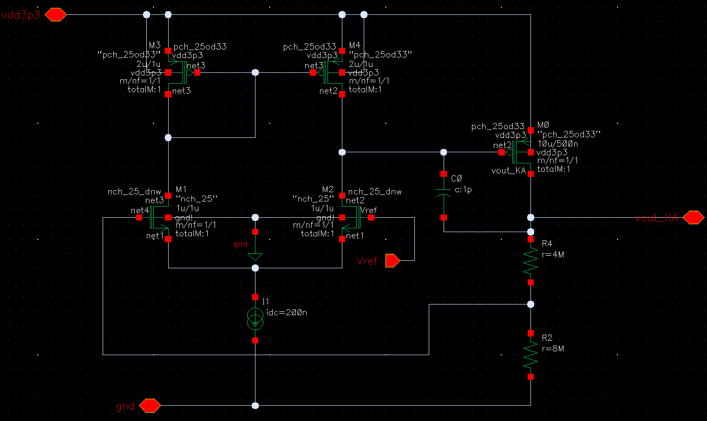
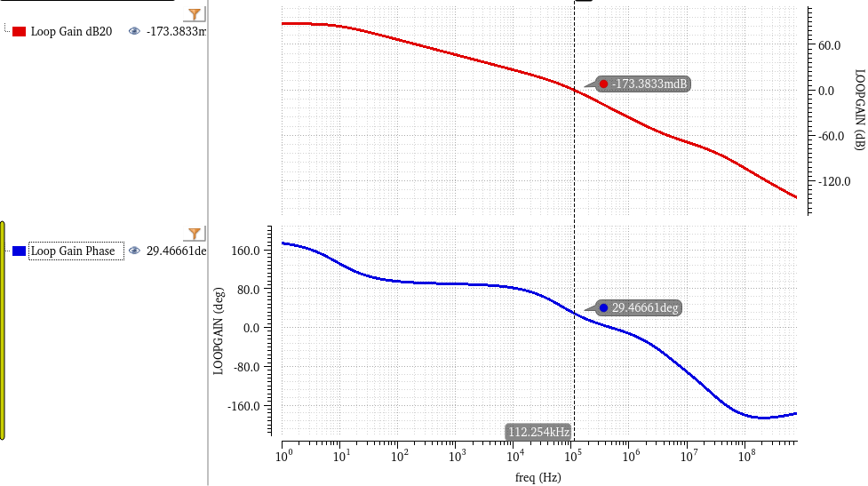
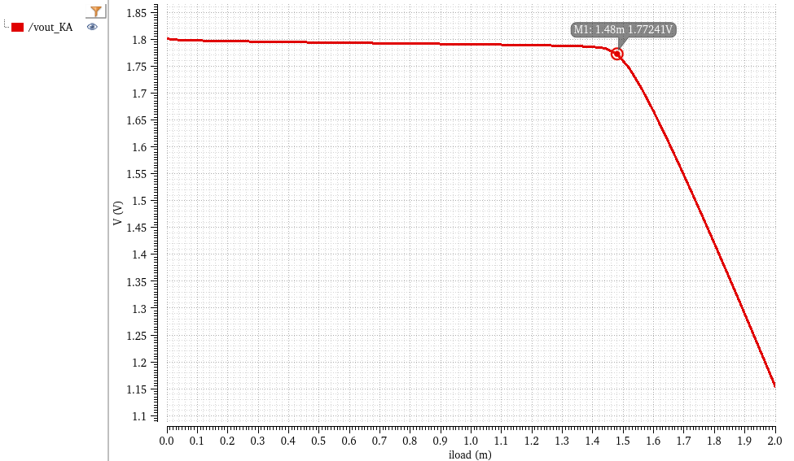
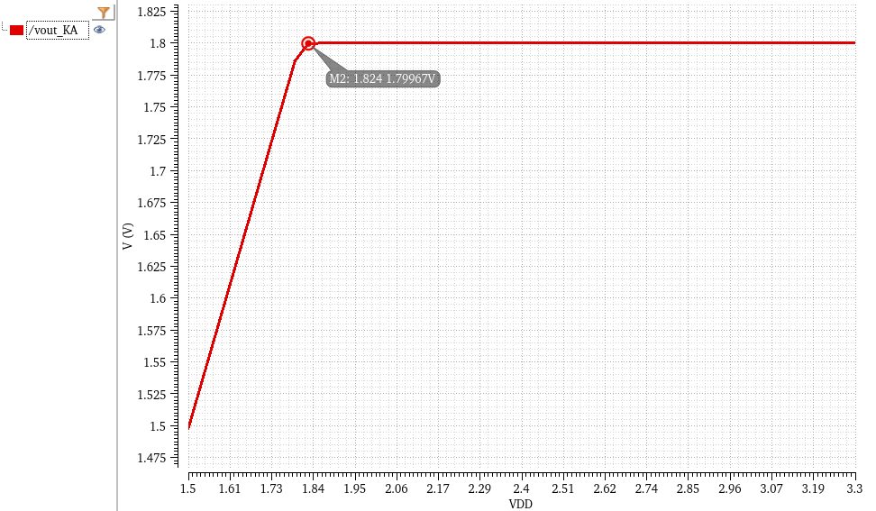

# Keep-Alive Auxiliary LDO (Sleep Mode Regulator)

This directory contains the schematic and simulation results for the ultra-low-power Keep-Alive (KA) LDO. This auxiliary regulator is exclusively active during the system's deep-sleep mode (`EN = 0V`), designed with the singular goal of maintaining a 1.8V retention voltage for digital logic while consuming absolute minimum quiescent current.

## 1. Circuit Architecture & Design Rationale

To achieve nano-ampere level power consumption, this module strips away all high-speed enhancement features and relies on a minimalist, highly optimized topology.

### Core Operating Principles:
* **Minimalist 5-Transistor OTA:** The error amplifier uses a basic 5-transistor Operational Transconductance Amplifier (OTA) architecture. By avoiding complex multi-stage or folded-cascode structures, it minimizes the number of current branches, drastically reducing static power.
* **Nano-Ampere Biasing:** The tail current of the OTA is strictly constrained to **200 nA**.
* **Mega-Ohm Feedback Network:** The internal resistor divider utilizes massive resistor values (8 MΩ and 4 MΩ, totaling 12 MΩ). This limits the static current bleeding through the feedback path to a mere 150 nA ($1.8\text{V} / 12\text{M}\Omega$).
* **Miller Compensation:** Given the extremely low transconductance (due to the 200nA bias), the dominant pole is exceptionally low. A simple 1 pF Miller capacitor (C0) is sufficient to guarantee absolute closed-loop stability.

**Power Measurement:**
* At a typical sleep-mode load of 1 µA, the total measured current is **1.35 µA**.
* Subtracting the load, the intrinsic quiescent current ($I_q$) of the LDO is approximately **350 nA**, perfectly matching the sum of the tail current and feedback network bleed.

*(Fig 1. Keep-Alive LDO Schematic featuring minimalist OTA and Mega-Ohm feedback)*

---

## 2. Performance Metrics

### 2.1 Loop Stability (STB Analysis)
*(Note: Evaluated at a 1 µA sleep-mode load)*
* **Phase Margin (PM):** 30°
* **Unit Gain Bandwidth (UGBW):** 112 kHz
* **Result:** The system is heavily over-compensated and unconditionally stable under light-load conditions.

*(Fig 2. Bode plot illustrating loop stability at 1 µA load)*

### 2.2 DC Load Regulation & Driving Capacity
Designed specifically for retention, this LDO has an intentional physical upper limit on its driving capability.
* **Maximum Regulated Load:** The output voltage successfully maintains 1.8V up to a load of 1.48 mA. Beyond this threshold, the 200nA tail current can no longer drive the power PMOS hard enough, resulting in a voltage drop. This highlights the architectural necessity of handing over control to the main FVF LDO during active mode.

*(Fig 3. Vout vs. Load Current demonstrating the retention driving limit)*

### 2.3 Dropout Voltage & Line Regulation
*(Note: Evaluated at a 1 µA sleep-mode load)*
* **Dropout Point:** As VDD decreases, the LDO maintains regulation until VDD drops below 1.824 V.
* **Dropout Voltage ($V_{do}$):** ~ 24 mV.

*(Fig 4. DC VDD Sweep indicating sleep-mode dropout characteristics)*
