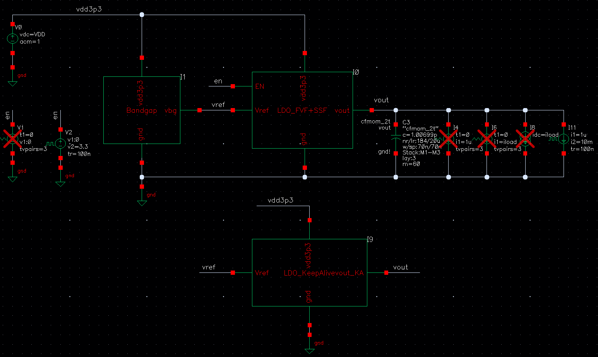
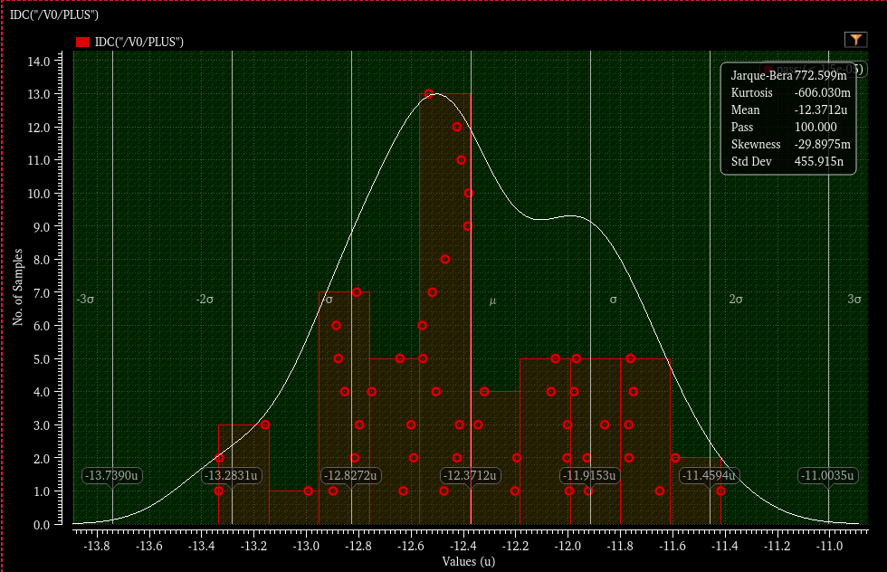
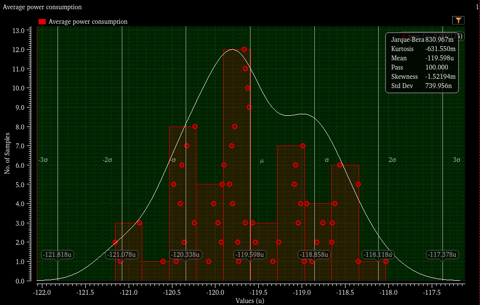
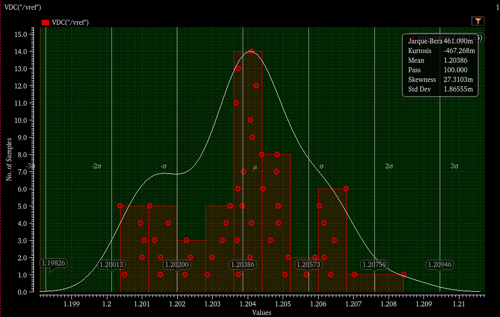
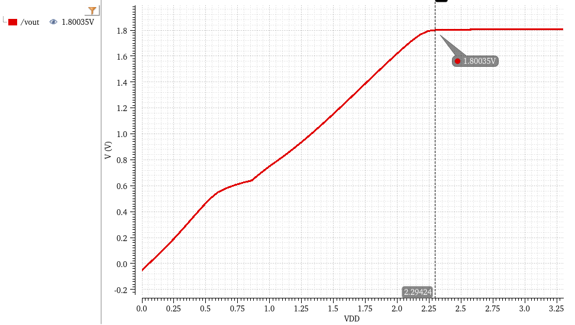
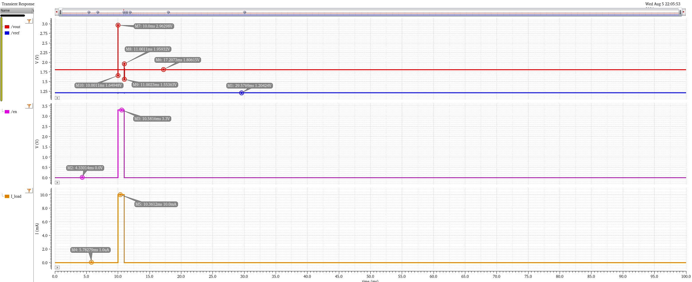
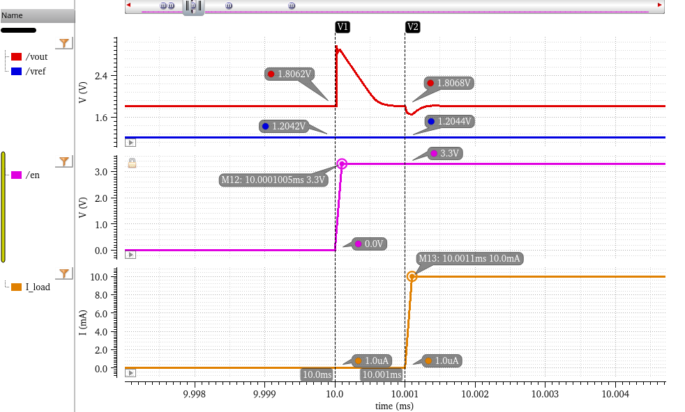
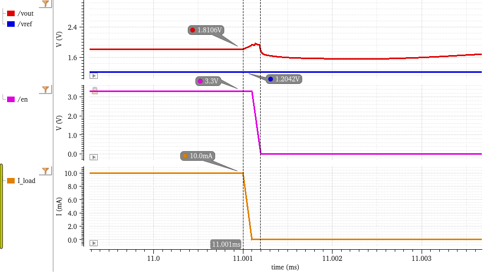

# PMIC Top-Level Testbench (PMIC_tb)

This directory contains the top-level testbench for the ultra-low-power PMIC LDO system. It validates the closed-loop performance, transient response, power consumption, and statistical yield under TSMC 40nm process variations.

## 1. Testbench Setup
The testbench integrates the Bandgap Reference (BGR), Error Amplifier, FVF LDO core, and Keep-Alive circuits. 
* **Input Voltage (Vin):** 3.3V
* **Target Output (Vout):** 1.8V
* **Enable Control (EN):** 0V (Deep Sleep) / 3.3V (Active)
* **Load Current (Iload):** 1µA (Sleep mode) to 10mA (Active mode)

*(Fig 1. PMIC Top-level Testbench Schematic)*

---

## 2. System Architecture & Design Rationale

This PMIC leverages a **Dual-Loop Architecture** to resolve the inherent conflict between ultra-low quiescent power and high-speed transient response, specifically optimized for wearable device power profiles (e.g., Smart Rings).

### Core Operating Principles:
* **Flipped Voltage Follower (FVF) Active Loop:** During active mode (`EN = 3.3V`), the system relies on the FVF core. Unlike traditional LDOs, the FVF architecture creates a local shunt-feedback loop with extremely low output impedance. This decoupling of the dominant pole from the load capacitor enables ultra-fast transient responses to heavy load steps (up to 10mA) without requiring massive, area-consuming off-chip decoupling capacitors.
* **Keep-Alive (KA) Deep-Sleep Loop:** During sleep mode (`EN = 0V`), the active load drops to 1µA. To strictly conserve battery life, the high-bandwidth Error Amplifier and the main FVF power stages are entirely powered down via ground cut-off switches. Simultaneously, a nano-ampere Keep-Alive auxiliary regulator seamlessly takes over, maintaining the 1.8V output to prevent logic state corruption in the digital baseband.
* **Physical Local Biasing:** Instead of relying on ideal current sources, the system utilizes a bespoke, ultra-low-power local bias network. This ensures that the simulated deep-sleep current accurately reflects the physical silicon leakage and biasing overhead, preventing yield failures during tape-out.

---

## 3. Key Performance Measurements

### 3.1 Quiescent Current (Iq) in Deep Sleep
Achieving ultra-low power is the primary goal of this wearable PMIC. By utilizing the ground cut-off strategy described above, the standby current is strictly minimized.
* **Measured Mean:** 12.37 µA
* **Standard Deviation (1σ):** 455.9 nA
* **Result:** The 3σ upper limit is tightly bounded below 14 µA, ensuring excellent yield against the 15 µA absolute maximum specification.

*(Fig 2. Monte Carlo Distribution of Deep Sleep Iq)*

### 3.2 Active Average Power Consumption
To evaluate the overall system efficiency during a typical active-sleep mixed workload cycle, the average power consumption was simulated across process and mismatch variations.
* **Measured Mean:** 119.6 µW
* **Standard Deviation (1σ):** 740.0 nW
* **Result:** Highly consistent power draw across 50 Monte Carlo runs, demonstrating stable thermal and battery life expectations.

*(Fig 3. Monte Carlo Distribution of Average Power Consumption)*

### 3.3 Bandgap Reference Precision
The internal BGR generates the reference voltage for the LDO. Statistical modeling verifies its robustness against local mismatches without the need for post-fabrication trimming.
* **Measured Mean:** 1.204 V
* **Standard Deviation (1σ):** 1.87 mV

*(Fig 4. BGR Output Voltage Distribution - Untrimmed)*

### 3.4 DC Line Regulation
The DC sweep demonstrates the LDO's dropout characteristics and stable regulation. As VDD ramps up, Vout successfully tracks and stabilizes at the 1.8V target (measured at 1.80035V at VDD=2.29V).

*(Fig 5. Vout vs. VDD DC Line Regulation)*

---

## 4. Transient Response & Known Limitations

### 4.1 Load Step & FVF Response
The FVF architecture achieves fast transient response without relying on large off-chip capacitors. The waveform below illustrates the system stability during extreme load toggling between 1 µA and 10 mA.

*(Fig 6. Transient response under a 10mA load step)*

### 4.2 Cold-Start Overshoot (Known Trade-off)
During a "No-Load Cold Start" scenario (where EN transitions to 3.3V while the active 10mA load is not yet engaged), the output voltage exhibits a transient overshoot peaking at approximately **2.96V**.

**Engineering Decision:** 
This is an intentional design trade-off. Limiting the active tail current of the error amplifier strictly to 10 µA (to maintain stringent global power constraints) restricts the amplifier's slew rate. Consequently, it cannot suppress the power PMOS gate voltage fast enough upon wake-up. It is documented here as a known characteristic. Future iterations may target an auxiliary fast-wake-up loop.

*(Fig 7. Cold-start overshoot detail)*

### 4.3 Safe Turn-off Dynamics
When the EN signal transitions low (system entering sleep mode), the load is carefully decoupled, ensuring Vout slowly decays without dangerous negative voltage undershoots that could trigger latch-up.

*(Fig 8. Turn-off transient safely entering sleep mode)*

---

## 5. How to Run Simulations
1. Open Cadence Virtuoso and navigate to `PMIC_LDO -> PMIC_tb -> schematic`.
2. Launch **ADE XL** or **ADE Assembler**.
3. Load the pre-configured state.
4. Ensure the TSMC 40nm `top_ttg_localmc` statistical model is selected in the Model Library before running the Monte Carlo passes.
